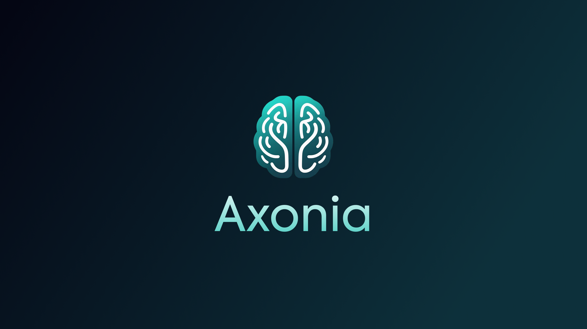

# Axonia



**Axonia** is a sleek, modern, and interactive web-based viewer for NIfTI neuroimaging files (`.nii`, `.nii.gz`), built with the latest web technologies. It provides a zero-installation, browser-based solution for researchers, clinicians, and students to visualize and explore brain data instantly.

*Mapping neural pathways, one voxel at a time.*

## Core Features

-   **Instant File Loading:** Upload NIfTI files (`.nii`, `.nii.gz`) directly from your local machine. All processing happens in the browser, ensuring your data remains private.
-   **Interactive 3D & 2D Views:** Seamlessly switch between Axial, Coronal, Sagittal, and a comprehensive Multi-planar view.
-   **Dynamic Colormaps:** Apply a wide range of standard medical imaging colormaps to highlight different tissue types and structures.
-   **Intuitive Controls:**
    -   **Contrast/Brightness:** Left-click + drag
    -   **Pan:** Right-click + drag
    -   **Zoom:** Scroll wheel
    -   **Slice Navigation:** Middle-click + drag
-   **Reset View:** A one-click button to reset the view to its default state.
-   **Responsive Design:** A fully responsive interface that works beautifully on any screen size.

## Roadmap & Future Features

Axonia is an active and ongoing project. We are continuously working on adding new features to make it a more powerful tool for neuroimaging analysis. Our roadmap includes:

-   **🧠 AI-Powered Analysis with Google Gemini:** Integrating Google's Gemini models to provide insightful, AI-driven analysis of imaging data, such as identifying anomalies or summarizing findings.
-   **🔬 Advanced Statistical Learning with Nilearn:** Incorporating the Nilearn library to enable powerful statistical analysis, machine learning, and predictive modeling directly within the viewer.
-   **✍️ Enhanced Annotation Tools:** Improving the drawing and annotation capabilities for more detailed analysis and collaboration.

## Technologies Used

-   [SvelteKit](https://kit.svelte.dev/) / [Svelte](https://svelte.dev/)
-   [NiiVue.js](https://niivue.github.io/niivue/)
-   [Tailwind CSS](https://tailwindcss.com/)
-   [TypeScript](https://www.typescriptlang.org/)

## Getting Started

1.  **Clone the repository:**
    ```bash
    git clone https://github.com/kulaizki/axonia.git
    cd axonia
    ```

2.  **Install dependencies:**
    ```bash
    npm install
    ```

3.  **Run the development server:**
    ```bash
    npm run dev
    ```

4.  **Open your browser** to the address provided (usually `http://localhost:5173`).

## Contributing

Contributions are what make the open-source community such an amazing place to learn, inspire, and create. Any contributions you make are **greatly appreciated**.

If you have a suggestion that would make this better, please fork the repo and create a pull request. You can also simply open an issue with the tag "enhancement".

1.  Fork the Project
2.  Create your Feature Branch (`git checkout -b feature/AmazingFeature`)
3.  Commit your Changes (`git commit -m 'Add some AmazingFeature'`)
4.  Push to the Branch (`git push origin feature/AmazingFeature`)
5.  Open a Pull Request

Don't forget to give the project a star! Thanks again!